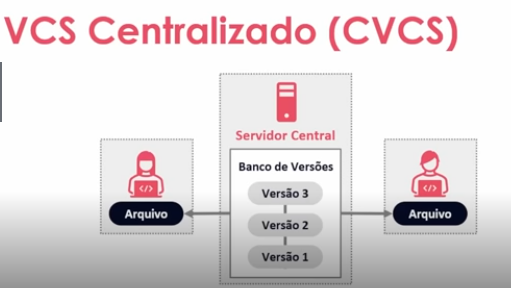
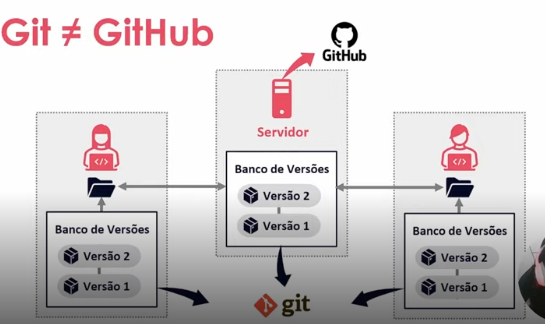

# Resumos | Introdução
Aqui está um resumo da introdução e dos tópicos iniciais do curso, abordando:

- **Versionamento de Código**
- **Sistema de Controle de Versão**
  - CVCS - Sistema de Controle de Versão Centralizado
  - DVCS - Sistema de Controle de Versão Distribuído
- **Git**
- **GitHub**
- **Diferença Entre Git e GitHub**

### 1️⃣ - Versionamento de Código e Sistemas de Controle de Versão

#### Versionamento de Código 🔄
O versionamento de código é uma maneira de guardar diferentes versões de um código-fonte ao longo do tempo. Isso permite que os programadores acompanhem as mudanças feitas, revertam para versões anteriores se necessário e trabalhem de forma colaborativa em projetos de software.

#### Sistema de Controle de Versão 📝
O sistema de controle de versão é a ferramenta que oferece os recursos necessários para gerenciar diferentes versões e o histórico de alterações. Você pode saber a hora da alteração, o autor, e etc. Isso melhora a organização do seu projeto, além de contribuir com segurança, pois quem determina que alguém vai alterar algo é o próprio desenvolvedor.

Existem dois tipos de sistemas de controle de versão:

#### - Centralizados (CVCS) 🎯
O VCS Centralizado vai ter um servidor centralizado, que vai conter todos os arquivos responsáveis pelo controle de versão nele. Imagem ilustrativa abaixo:

Ele tem como desvantagem se ele ficar fora do ar, você fica sem conseguir salvar ou colaborar com o projeto, além de se qualquer versão ou arquivo ficar corrompido ou você ter alguma perda de dados nele e não tiver um backup adequado, você acaba perdendo todo o seu projeto. A gente tem como exemplo de VCS Centralizados os softwares: CVS e Subversion.

#### Distribuídos (DVCS) 🎯
Visando os problemas que os desenvolvedores tinham ao utilizar os CVCS, surgiram os Sistemas de Controle de Versão Distribuídos. Então ao invés de todo o seu banco de versão ficar em um servidor centralizado, os softwares de DVCS vão clonar o repositório na sua máquina.

O DVCS clona o repositório completo, o que inclui o histórico de versões. A gente tem como exemplo de VCS Distribuídos os Softwares: Git e Mercurial.
____

### 2️⃣ - Git (DVCS)
[Site do Git](https://git-scm.com/)

#### O que é Git? 🚀
O Git é um sistema de controle de versão distribuído, além de ser um dos mais utilizados atualmente, e isso se deve ao fato dele ser:

- Gratuito e Open Source;
- Ramificações (branching) e fusões (merging) eficientes;
- Leve e rápido.

#### Breve Histórico do Git 🕰️
- 2002 -> A história do Git tem relação com o projeto do núcleo do Linux, que é open source, que ali ele começa a utilizar o BitKeeper, que é um DVCS proprietário que significa que ele não é de código aberto, então ele pertence à empresa desenvolvedora.
- 2005 -> Após conflitos com a comunidade, envolvendo engenharia reversa (pirataria), o BitKeeper rescinde a licença gratuita. O que leva a Linus Torvalds, o criador do Linux, e sua equipe a desenvolverem sua própria ferramenta, o Git.

### 3️⃣ - GitHub
[Site do GitHub](https://github.com/)

#### O que é GitHub 🐱
É uma plataforma de hospedagem de código para controle de versão com Git, e colaboração.

#### Breve Histórico do GitHub 📜
2008 -> Desenvolvido por Chris Wanstrath, J. Heytt, Tom Preston-Wernet e Scott Chacon.
2018 -> Foi vítima de um dos maiores ataques de DDoS e no mesmo ano foi comprado pela Microsoft Corporation por US $ 7,5B.

### Git ≠ GitHub

- Git: Atua na parte do banco de versões, onde vai fazer o gerenciamento das versões do seu código;
- GitHub: Vai ser o servidor onde vai estar hospedando o seu código remotamente.